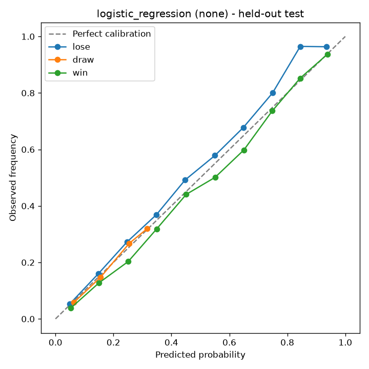

# National Team Predictor ⚽

Win / draw / loss probabilities for men's international football matches, from
ELO ratings and team form. Ships as an installable Python package with a CLI, a
JSON API and a small web UI.

On matches from 2019 onwards — data the model never saw during training or model
selection — it reaches **0.860 log loss and 60.6% accuracy**, against 1.051 and
47.8% for a baseline that always predicts the historical class frequencies.

```bash
$ wcp predict Argentina Switzerland --knockout
Argentina vs Switzerland  (neutral venue, major)
  ELO 2081 vs 1873  (diff +209)
  Argentina win  57.9%   Draw  26.3%   Switzerland win  15.8%
  Advances: Argentina  74.2%   Switzerland  25.8%
```

## Setup

```bash
python -m venv .venv
.venv\Scripts\activate          # Windows
# source .venv/bin/activate     # macOS / Linux

pip install -e ".[xgboost,plots,api,dev]"
```

Download `results.csv` from the [International Football Results](https://www.kaggle.com/datasets/martj42/international-football-results-from-1872-to-2017)
dataset (men's national team matches, 1872–present) and put it in `data/`. Then:

```bash
wcp train           # ~90 seconds; writes models/ and reports/
wcp predict Brazil France --knockout
wcp serve           # web UI on http://127.0.0.1:8000
```

## What the model learns

Every feature is computed from matches played strictly *before* the one being
predicted.

| Feature group | Columns |
|---|---|
| **ELO** | `elo_diff`, `home_elo`, `away_elo` — implemented from scratch, updated match by match, with a home-advantage bonus that is switched off at neutral venues |
| **Career form** | Cumulative pre-match win rate, draw rate and average goal difference per team |
| **Recent form** | Last-5 and last-10 win rates, last-5 average goal difference |
| **Context** | Neutral venue flag; friendly / qualifier / major-tournament flags |

The two branches deliberately overlap — recent form partly restates what ELO
already encodes — and the elastic-net penalty is left to sort out which parts
survive. It settles firmly on rating difference:

| Feature | Weight |
|---|---|
| `elo_diff` | 0.455 |
| `away_cum_goal_diff` | 0.111 |
| `neutral_int` | 0.103 |
| `away_pre_win_rate` | 0.098 |
| `home_cum_goal_diff` | 0.094 |
| *(15 more, all below 0.09)* | |

## How it is evaluated

Time is split three ways, and each slice is allowed to influence exactly one
decision:

| Slice | Matches | What it decides |
|---|---|---|
| Train (before 2016) | 37,186 | Hyper-parameters, via `TimeSeriesSplit` inside the slice |
| Validation (2016–2018) | 2,684 | Which model family, and which calibration method |
| Test (2019 onwards) | 7,221 | Nothing — scored once, at the end |

Model search, by log loss:

| Model | CV log loss (train) | Validation log loss | Validation accuracy |
|---|---|---|---|
| **Logistic regression** (selected) | **0.9088** | **0.8992** | 0.5794 |
| XGBoost | 0.9124 | 0.9007 | 0.5760 |
| Random forest | 0.9165 | 0.9046 | 0.5760 |

The linear model wins, and it is worth being clear about why: international
football is high-noise and dominated by a single roughly linear signal, the
strength gap. Tree ensembles have room to fit texture that does not repeat.

Held-out test, scored once:

| | Log loss | Accuracy | Brier |
|---|---|---|---|
| Model | **0.8598** | **0.6059** | 0.5052 |
| Class-prior baseline | 1.0505 | 0.4781 | 0.6335 |

Accuracy above bookmaker-model territory (53–55%) mostly reflects the era: the
test window contains many lopsided qualifiers, which are easy to call. Log loss
is the number to watch.

### Calibration

Isotonic and Platt scaling were both fitted on the training slice and compared
on validation. Neither helped:

| Method | Validation log loss |
|---|---|
| **None** (selected) | **0.8992** |
| Sigmoid (Platt) | 0.9145 |
| Isotonic | 0.9266 |

That is the expected result for a regularized logistic regression, which
optimises log loss directly and so tends to come out calibrated already. The
reliability diagram on the held-out test confirms it — predictions track the
diagonal across the whole range:



*(`wcp train` regenerates this at `reports/calibration_test.png`; the copy in
`docs/` is the committed snapshot.)*

The pipeline still runs the comparison on every training run, so if the feature
set or model choice changes and calibration starts to pay off, it gets picked up
automatically.

## Usage

### Command line

```bash
wcp train [--full-grid] [--data PATH] [--jobs N]   # search, evaluate, save
wcp predict Spain England --knockout               # one fixture
wcp predict Brazil Norway --home-advantage --competition friendly
wcp teams --search port                            # known teams, by ELO
wcp report                                         # metrics from the saved bundle
wcp serve --port 8000                              # API + web UI
```

`--full-grid` searches the wide hyper-parameter grids instead of the trimmed
defaults. It takes considerably longer and, on this data, lands in the same
place.

### Python

```python
from wcpredictor import Predictor

predictor = Predictor.load()
prediction = predictor.predict("Brazil", "France", neutral=True, knockout=True)

print(prediction.home_win, prediction.draw, prediction.away_win)
print(prediction.home_advance)
```

### HTTP API

`wcp serve` exposes the web UI at `/` and interactive OpenAPI docs at `/docs`.

| Endpoint | Purpose |
|---|---|
| `GET /api/health` | Whether a trained bundle is loaded, and which one |
| `GET /api/teams` | Every known team with its current ELO |
| `GET /api/metrics` | The full training report |
| `POST /api/predict` | Probabilities for one fixture |

```bash
curl -X POST localhost:8000/api/predict \
  -H "Content-Type: application/json" \
  -d '{"home_team":"Spain","away_team":"England","neutral":true,"knockout":true}'
```

## Project structure

```
src/wcpredictor/
  config.py      Paths, split dates, ELO parameters, feature list
  data.py        Loading, cleaning, result labelling, label encoding
  elo.py         From-scratch ELO ratings
  features.py    Leakage-safe form features and the match feature table
  modeling.py    Candidate models and their grids
  train.py       The train/select/calibrate/test protocol
  evaluate.py    Log loss, Brier, baselines, reliability diagrams
  predict.py     Predictor for trained bundles
  artifacts.py   Model bundle read/write
  api.py         FastAPI backend
  cli.py         `wcp` entry point
  web/           Single-page UI (no build step)
tests/           62 tests, all on synthetic data — no Kaggle download needed
explore.ipynb    Original research notebook, kept as the record of how this was worked out
```

`models/` and `reports/` are generated by `wcp train` and are not checked in.

## Notes on the design

A few decisions are worth flagging, because the obvious alternative is wrong in
a way that is easy to miss.

**Matches are joined on a chronological `match_id`, not on `(date, team)`.** Some
teams played two matches on the same day in the early 1900s, so `(date, team)`
is not a unique key. Merging on it produces a Cartesian product — a team with
two matches on one day yields four rows, two of which pair a match with the
wrong team's features. `tests/test_features.py` has a regression test built from
Argentina's 1916 fixture list.

**Preprocessing lives inside the `Pipeline`.** Fitting a `StandardScaler` on the
whole training set before cross-validating leaks fold-test statistics into
fold-train. Wrapping the scaler in a `Pipeline` means it is refitted per fold.

**Prediction-time form includes the most recent match.** Training features are
shifted by one to stay leakage-safe, so the last row of a team's history
excludes its own result. Reusing that row for prediction would silently ignore
the team's latest match; `build_current_team_state` recomputes the unshifted
state instead.

**Knockout ties do not split draws 50/50.** Extra time and penalties are close
to a coin flip but not exactly one, so the stronger side by ELO takes a slightly
larger share, capped at about 62% however lopsided the gap is.

## Development

```bash
pytest              # 62 tests, ~5 seconds, no data download required
ruff check .
```

The test suite generates its own synthetic fixture list with a known strength
signal, so it verifies real behaviour (form features look only backwards, ELO is
zero-sum, the model beats its baseline) without depending on the Kaggle file.

## Roadmap

- [x] Feature engineering (ELO, form, goal difference, tournament importance)
- [x] Model comparison and selection (leakage-safe, log-loss based)
- [x] Probability calibration (isotonic / Platt, compared on validation)
- [x] Final held-out test evaluation
- [x] Backend API + web frontend
- [ ] Tournament bracket simulation (Monte Carlo over a full knockout draw)
- [ ] Squad-level features (availability, injuries, market value)

## Licence

MIT.
